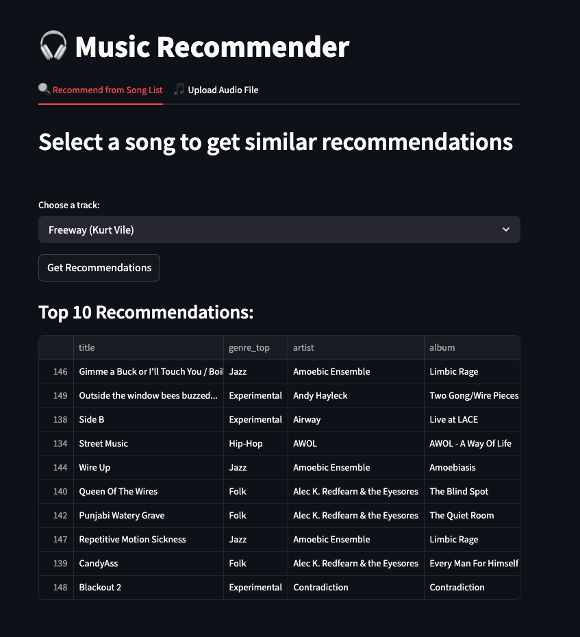
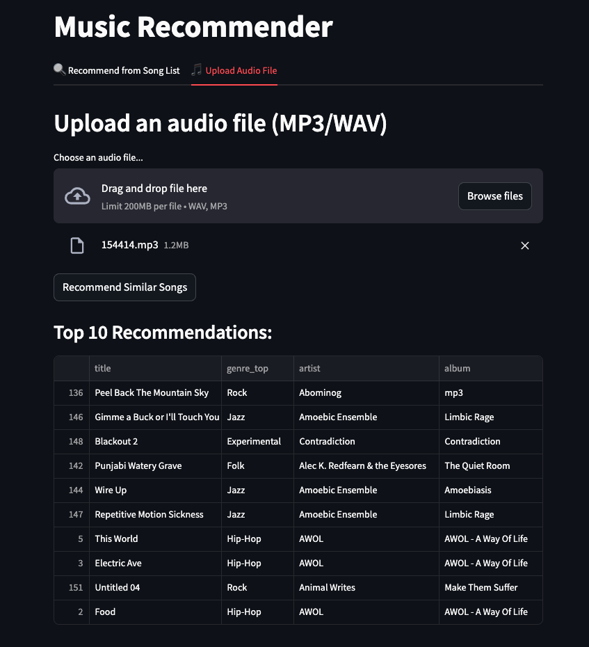

# Music Recommendation System

This project builds a **content-based music recommender** using audio features extracted from the **Free Music Archive (FMA)** dataset. It uses **deep learning models (PANNs)** to extract embeddings, scales them, and computes **cosine similarity** to recommend similar tracks.

You can run the entire pipeline on local subsets, or scale it with **Dask** and **PySpark** for larger datasets like `fma_small`.

---

## Features

- Deep audio feature extraction (PANNs)
- Scalable audio preprocessing with **Dask** / **PySpark**
- Content-based recommendation using **cosine similarity**
- Web app with **Streamlit** UI
- Model saving & efficient reloading for inference
- Metadata integration for song title/genre display

---

## Demo

### Streamlit UI

---

## Dataset

- [Free Music Archive (FMA)](https://os.unil.cloud.switch.ch/fma/fma_small.zip)
- We use the `fma_small` subset (~8000 audio files, each 30s, ~7.68 GB)
- Metadata from `tracks.csv`

---

